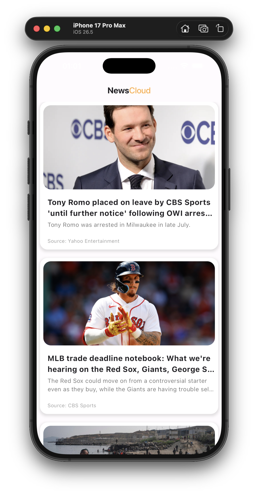

# news_cloud

[](https://flutter.dev)
[](https://dart.dev)
[]()

`news_cloud` is a Flutter news reader app that fetches top headlines from the NewsAPI service and presents them in a clean, card-based interface. The app focuses on fast browsing, readable article previews, and category visuals for a polished mobile experience.

## Overview

The app opens to a simple news feed that loads top headlines from a remote API using `dio`. Each article is displayed with a large hero image, title, summary, and source attribution. The project also includes reusable category assets for business, entertainment, health, science, sports, and technology sections.

## Features

- Pulls top headlines from NewsAPI.
- Displays articles in a modern scrollable card layout.
- Shows article image, title, description, and source.
- Includes image fallback handling when an article image is unavailable.
- Uses reusable category models and assets for news sections.
- Supports both iOS and Android.

## Screenshots

| Preview | Caption |
| --- | --- |
|  | Home screen showing the NewsCloud feed with headline cards and article previews. |

## Tech Stack

| Technology | Purpose |
| --- | --- |
| Flutter | Cross-platform UI framework |
| Dart | Application language |
| Dio | HTTP client for API requests |
| NewsAPI | Source of news articles |
| Material Design | UI styling and layout primitives |

## Packages Used

| Package | Version | Usage |
| --- | --- | --- |
| `flutter` | SDK | App framework |
| `dio` | `^5.9.2` | Fetching articles from the NewsAPI endpoint |
| `cupertino_icons` | `^1.0.8` | iOS-style icons support |
| `flutter_test` | SDK | Widget and unit testing |
| `flutter_lints` | `^4.0.0` | Lint rules and code quality checks |

## Installation

### Prerequisites

- Flutter SDK installed
- Dart SDK included with Flutter
- An emulator, simulator, or physical device

### Setup

1. Clone or open the project in your editor.
2. Install dependencies:

```bash
flutter pub get
```

3. If needed, update the NewsAPI key in [lib/services/news_service.dart](lib/services/news_service.dart) with your own API key.

## Run The App

Use one of the following commands from the project root:

```bash
flutter run
```

To run on a specific device, list available targets first:

```bash
flutter devices
flutter run -d <device_id>
```

## Project Structure

```text
news_cloud/
├── assets/
│   ├── business.avif
│   ├── entertainment.avif
│   ├── general.avif
│   ├── health.avif
│   ├── science.avif
│   ├── sports.avif
│   └── technology.jpeg
├── lib/
│   ├── main.dart
│   ├── models/
│   │   ├── article_model.dart
│   │   └── category_model.dart
│   ├── services/
│   │   └── news_service.dart
│   ├── views/
│   │   └── news_veiw.dart
│   └── widgets/
│       ├── categories_list_view.dart
│       ├── category_card.dart
│       ├── news_list_view.dart
│       └── news_tiles.dart
├── android/
├── ios/
└── Screenshot.png
```

## Notes

- The app currently uses a hardcoded NewsAPI endpoint in the service layer.
- The README screenshot path is relative to the repository root, so GitHub will render it correctly.
- If you add more screenshots later, place them in the root or a dedicated folder and update the table above accordingly.
